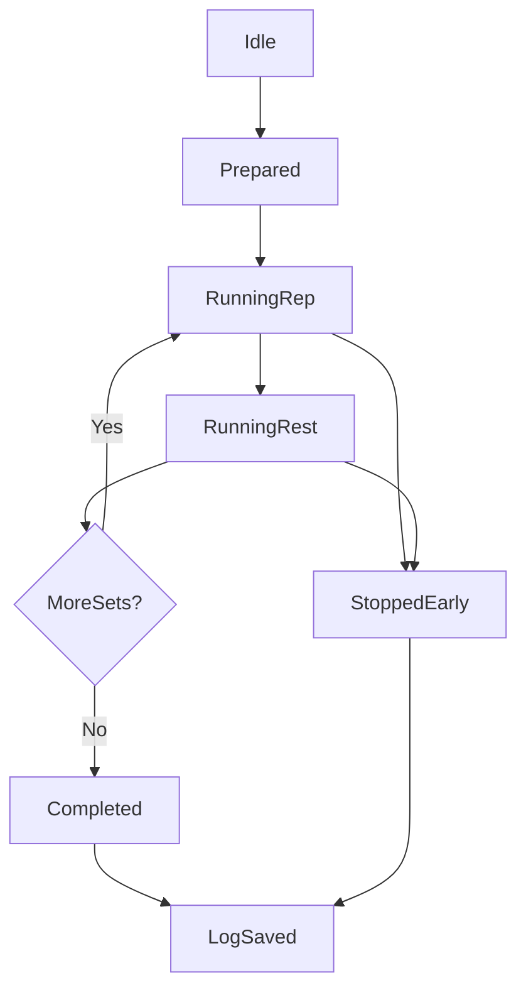

# Rock Climbing Training App: Schedule-First Product Plan

## Product Goal

Build a training app where climbers create reusable training items and schedule those items directly onto a calendar. The calendar is the source of truth:

- History is permanent and never rewritten.
- Upcoming sessions are editable.
- Completed sessions are snapshots and immutable.

## Core User Outcomes

- Create reusable training items quickly.
- Discover and collect useful training items from others.
- Add items to a real training calendar as sessions.
- See all historical sessions and future sessions across the full calendar.
- Adjust upcoming session variables without mutating completed history.
- Execute sessions with timer flow and keep reliable records.
- Track progress and present climbing identity.

## Scope Breakdown

### 1) Training Items (Create, Publish, Browse)

**Functional requirements**

- Users create training items with fields like:
  - Title, description, category, tags
  - Variables (weight, reps, sets, rest, duration)
  - Difficulty and equipment metadata
- Draft/publish lifecycle:
  - Draft (private editable)
  - Published (discoverable)
- Browse/search community items:
  - Filters by tags, category, climbing style, difficulty, popularity, recency
- Collect/save items from others into a personal library.

**Data model (high-level)**

- `TrainingItem`
- `TrainingItemVariables` (template defaults)
- `TrainingItemTag` / `Category`
- `SavedItem` (user-item relationship)
- `ItemEngagement` (views, saves, uses)

**Popularity tracking**

- Metrics: views, saves, plan-inclusions, session-completions.
- Score formula example: weighted rolling score (recent activity weighted higher).

---

### 2) Training Schedule / Calendar (Sessions, Overrides, Immutability)

**Functional requirements**

- Add sessions to calendar by selecting:
  - Own items
  - Collected/saved items
- Each calendar session stores an item snapshot + session overrides.
- Calendar view shows:
  - All historical sessions (infinite history)
  - Future sessions across all months (not window-limited)
- Recurring scheduling:
  - Daily, weekly, monthly recurrence rules
  - Optional end date or no-end recurring series
- Edit behavior:
  - Upcoming sessions can be edited (date, overrides, notes)
  - Historical/completed sessions are immutable
- Completing a session freezes its record as history.

**Schedule architecture concepts**

- `TrainingScheduleSession`
  - `scheduledFor`
  - `completedAt` (optional)
  - `snapshot` (item metadata + default variables at scheduling time)
  - `overrides` (per-session adjustments)
- Session update rule:
  - editable only when upcoming and incomplete
  - immutable once completed or in the past

---

### 3) Timer + Training Logs (Execution Engine)

**Functional requirements**

- Most items support timer-based execution:
  - Rep timer
  - Rest timer
  - Set loops
- Starting timer creates a training log session.
- Session can end in two ways:
  - Completed (all planned sets/blocks finished)
  - Stopped early (premature end with partial data)
- Persist per-step outcomes:
  - Completed reps/sets, actual durations, skipped sets, user notes.

**Execution state machine**

**Key reliability requirements**

- Timer resilience during app backgrounding.
- Local-first buffering with eventual sync.
- Log integrity: never lose partial workout data.

---

### 4) Profile + Climbing Context

**Functional requirements**

- Profile fields:
  - Climbing styles (bouldering/sport/trad/etc.)
  - Climbing age (years/months)
  - Highest grades by style
  - Countries/regions climbed
  - Optional goals and bio
- Show aggregate stats:
  - Sessions/week, total completed plans, consistency streak, personal bests.

**Privacy controls**

- Public/private toggles for profile fields and workout history visibility.

---

## Cross-Cutting Feature Requirements

### Discovery, Search, and Filtering

- Unified taxonomy system for items and schedule entries:
  - `category` (single primary bucket)
  - `tags` (multi-label descriptors)
- Search by text + structured filters.
- Ranking modes (for items): popular, newest, recommended.

### Permissions and Ownership

- Owner can edit own drafts/published items.
- Consumers can save/clone but not mutate original published records.
- Users can schedule their own items or saved/published items.
- Past/completed sessions cannot be edited.

### Analytics and Popularity

- Events to capture:
  - View item
  - Save item
  - Add item to calendar
  - Start/complete/stop session
- Build popularity score per item with anti-spam constraints.

### Non-functional Priorities

- Fast timer performance and stable session logging are top priority.
- Offline/spotty-network tolerance for active workouts.
- Auditability for schedule and item provenance.

## Iterative Implementation Roadmap

### Iteration 0 - Product/Design Foundation

**Goal**: lock information architecture and domain model.

- Define entities and relationships for items/schedule sessions/logs/profile.
- Define taxonomy (categories and tags) and popularity events.
- UX flows for create -> schedule -> timer -> log -> profile updates.

**Exit criteria**

- Approved ERD + UX wireframes for core flows.

---

### Iteration 1 - MVP Content Layer (Items + Profiles)

**Goal**: users can create/publish/browse training items and set profiles.

- Auth + user profile basics.
- CRUD for training items with draft/publish status.
- Item browse with simple filters and text search.
- Save/collect item to personal library.

**Exit criteria**

- User can create, publish, discover, and collect items end-to-end.

---

### Iteration 2 - Calendar Scheduler v1

**Goal**: users can schedule training sessions directly on a calendar.

- Calendar session CRUD for upcoming sessions.
- Add own/collected items into scheduled sessions.
- Per-session overrides (weight/reps/sets/rest/duration).
- Calendar view with:
  - Full history
  - Future sessions across all months
- Recurring session scheduling (Google Calendar-like):
  - One-time event
  - Recurring series (daily/weekly/monthly)
- Immutability guardrails:
  - Updating sessions only affects upcoming, incomplete sessions.
  - Completed/past sessions remain unchanged.

**Exit criteria**

- User can add, edit, complete, and review sessions from calendar with correct historical immutability.

---

### Iteration 3 - Timer Engine + Logging v1

**Goal**: execute scheduled sessions with reliable logs.

- Timer states (rep/rest/set loop).
- Start timer => create active session log.
- Complete or stop-early flows, both persisted.
- Session history view (basic).

**Exit criteria**

- User can run a full session and see accurate completed/partial logs.

---

### Iteration 4 - Discovery and Social Extensions

**Goal**: improve inspiration and engagement beyond individual schedule usage.

- Better item discovery and recommendation.
- Optional schedule templates (not required for core MVP).
- Optional sharing mechanisms.
- Popularity scoring and ranking lists.

**Exit criteria**

- User can discover high-quality community items and optionally shared templates.

---

### Iteration 5 - Quality, Personalization, and Scale

**Goal**: improve retention and robustness.

- Recommendations (based on style/level/history).
- Better profile stats and progress dashboards.
- Offline reliability hardening for timer/log sync.
- Anti-abuse/quality moderation for public content.

**Exit criteria**

- Stable, scalable experience with meaningful personalization.

## Suggested MVP Boundary (to ship quickly)

Ship Iterations 1-3 first with strict focus on:

- Item creation/publishing/browsing
- Calendar scheduling with per-session overrides
- Immutable history + full calendar visibility
- Timer-driven session logging (complete + stop-early)
- Basic profile and tagging

Defer advanced social and recommendation features to Iterations 4-5.

## Delivery Risks and Mitigations

- Timer drift/background interruptions -> use monotonic time and recoverable state snapshots.
- Data inconsistency between source item and scheduled session -> snapshot at schedule time.
- History corruption via edits -> enforce server-side immutability for completed/past sessions.
- Community content quality -> moderation/reporting and popularity anti-gaming rules.
- Scope expansion -> maintain MVP gate with strict acceptance criteria per iteration.
